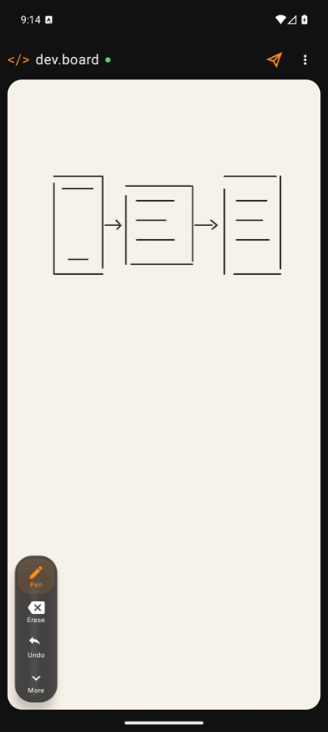
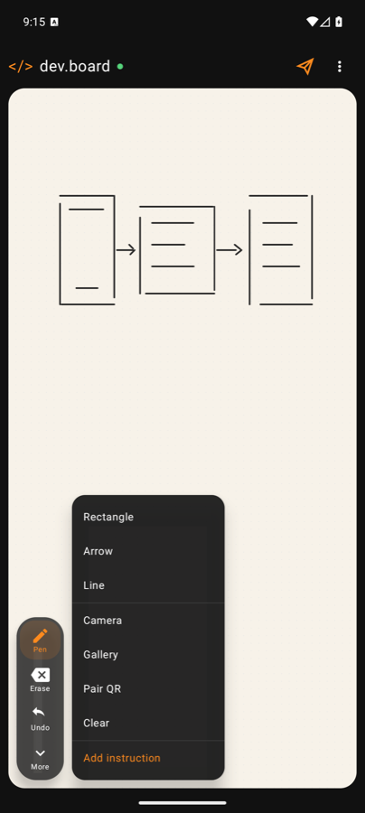
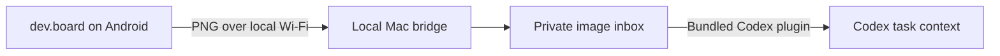

# dev.board

### Turn any Android phone into a private visual input surface for Codex.

Draw a diagram, annotate a screenshot, or scribble an idea—then send it to your local Codex agent over Wi-Fi. No cloud upload, account, Firebase project, or IP address to type.

[](https://github.com/dreamhunter02/codex-scratchpad/releases/latest)
[](https://github.com/dreamhunter02/codex-scratchpad/releases/latest/download/codex-scratchpad-latest.apk)
[](https://developer.android.com/about/versions/oreo)
[](https://github.com/dreamhunter02/codex-scratchpad/actions/workflows/release.yml)
[](LICENSE)
[](https://github.com/dreamhunter02/codex-scratchpad/stargazers)

<p align="center">
  
  &nbsp;&nbsp;
  
</p>

## Why dev.board?

Voice and keyboards are great for words. Architecture sketches, UI flows, annotations, equations, and half-formed ideas are often faster by hand. dev.board makes the phone already beside you another input device for your coding agent.

## Highlights

- **Canvas first** — nearly the entire screen remains available for drawing.
- **Any pointer** — finger, S Pen, or another Android stylus.
- **Infinite dotted grid** — pinch to zoom and use two fingers to pan.
- **Low-latency ink** — stylus pressure and AndroidX motion prediction.
- **Useful tools** — pen, eraser, undo, rectangles, arrows, and lines.
- **Annotate anything** — import from the camera or photo gallery.
- **One-tap send** — the paper-plane button pushes the current board to Codex.
- **Zero-config discovery** — Bonjour/mDNS finds the Mac on the local network.
- **Private by default** — images stay on your trusted Wi-Fi and local filesystem.

## Quick start

### 1. Install the Android app

[**Download the latest APK →**](https://github.com/dreamhunter02/codex-scratchpad/releases/latest/download/codex-scratchpad-latest.apk)

Android may ask you to allow installation from your browser or file manager. Preview releases are debug-signed; if Android rejects an update, uninstall the older preview build first.

### 2. Start the Mac bridge

Clone this repository, then run:

```bash
python3 bridge/mcp_server.py --http-only
```

The bridge advertises itself over Bonjour and stores received images in:

```text
~/.codex-scratchpad/inbox
```

### 3. Install the Codex plugin

The bundled plugin lives at [`plugins/codex-scratchpad`](plugins/codex-scratchpad). Add this repository as a local Codex plugin marketplace and install **Codex Scratchpad**.

### 4. Draw and send

Keep the phone and Mac on the same Wi-Fi, open dev.board, draw something, and tap the paper-plane icon. Then ask Codex:

> Read my newest scratchpad image.

## How it works



The Android app discovers the bridge through Bonjour. A local HTTP endpoint accepts the PNG, while the Codex plugin reads the same private inbox through three small tools:

| Tool | Purpose |
| --- | --- |
| `scratchpad_latest` | Retrieve the newest pending image and optional instruction |
| `scratchpad_list` | List images in the local inbox |
| `scratchpad_acknowledge` | Mark an image as processed |

The image becomes context for Codex. Sending a drawing does **not** automatically authorize code changes or external actions.

## QR pairing fallback

Some guest or corporate Wi-Fi networks block Bonjour. Generate a local pairing QR when automatic discovery is unavailable:

```bash
python3 bridge/mcp_server.py --token "choose-a-long-random-secret" --http-only
swift bridge/pairing_qr.swift \
  --endpoint "http://YOUR-MAC-LAN-IP:8787" \
  --token "choose-a-long-random-secret" \
  --output pairing.png
```

Open `pairing.png` on the Mac and choose **Pair QR** from dev.board's overflow menu. The endpoint and secret are stored only on the phone.

## Build from source

Requirements:

- JDK 17
- Android SDK 35
- Android device or emulator running API 26+

```bash
./gradlew :app:assembleDebug
adb install -r app/build/outputs/apk/debug/app-debug.apk
```

Run the same checks used before a release:

```bash
./gradlew :app:assembleDebug :app:lintDebug
```

Tags matching `v*` trigger the release workflow and publish both a versioned APK and the stable `codex-scratchpad-latest.apk` download.

## Security and privacy

- The normal data path stays on the local network.
- No Firebase, analytics SDK, account, or hosted relay is required.
- The bridge binds to the LAN; use it only on a trusted network.
- Pairing tokens protect the QR fallback but do not turn an untrusted network into a trusted one.

See [SECURITY.md](SECURITY.md) for reporting vulnerabilities.

## Roadmap

- [x] Automatic Bonjour discovery
- [x] QR pairing fallback
- [x] Infinite dotted canvas with zoom and pan
- [x] Shapes, camera, and gallery annotation
- [x] GitHub APK releases
- [ ] Signed production builds
- [ ] One-command Mac installer
- [ ] iPhone and iPad client
- [ ] Optional self-hosted remote relay

## Contributing

Issues and pull requests are welcome. Start with [CONTRIBUTING.md](CONTRIBUTING.md), follow the [Code of Conduct](CODE_OF_CONDUCT.md), and keep new data paths local-first unless the feature explicitly requires otherwise.

## License

dev.board is available under the [MIT License](LICENSE).
