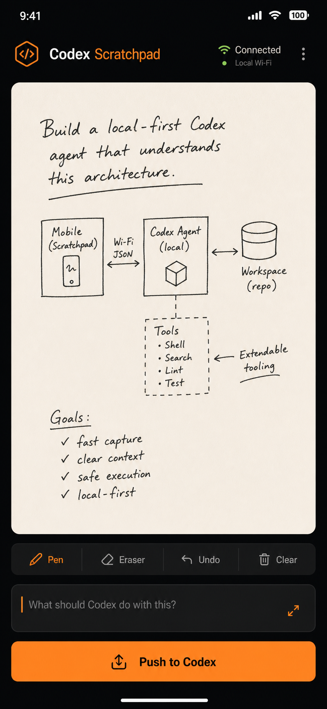

# Codex Scratchpad

[](https://developer.android.com/)
[](https://developers.openai.com/)
[](https://github.com/dreamhunter02/codex-scratchpad/releases/latest/download/codex-scratchpad-latest.apk)
[](LICENSE)
[](https://github.com/dreamhunter02/codex-scratchpad/stargazers)

**Your phone is a visual input surface for Codex.** Draw with a finger, S Pen, Apple Pencil, or any stylus; tap **Push to Codex**; your local Codex agent receives the image.



## What it does

```text
phone / tablet ── Bonjour discovery ──> Codex Scratchpad on Mac ──MCP──> Codex
     draw + caption                        private PNG inbox          agent context
```

- Infinite dotted-grid canvas with finger + S Pen/stylus pressure support
- Shape tools: rectangle, arrow, and line; undoable with freehand marks
- Camera + gallery image annotation, then push the annotated image to Codex
- Pinch to zoom; pan with two fingers while keeping one-finger drawing natural
- Mobile and tablet responsive layout
- Zero-config local discovery: no Mac IP address or port to type
- Dependency-free Python bridge + MCP server
- No Firebase, account, cloud sync, or external image upload
- Image and optional caption are delivered to Codex as context—not automatic authorization

## Try it on a Galaxy S26 Ultra

1. Install the Android app.

```bash
./gradlew :app:assembleDebug
adb install -r app/build/outputs/apk/debug/app-debug.apk
```

2. Install the Codex plugin.
3. Keep phone + Mac on the same Wi-Fi.
4. Open the app. It finds the Codex Scratchpad service automatically, then pairs once.
5. Draw, optionally add an instruction, and tap **Push to Codex**. Pinch to zoom and use two fingers to pan across the dotted canvas.

There is no IP address, port, terminal command, Firebase project, or cloud account in the user flow.

Codex receives the sketch through these private local MCP tools:

| Tool | Purpose |
| --- | --- |
| `scratchpad_latest` | Get the newest pending image and its caption |
| `scratchpad_list` | View the local inbox |
| `scratchpad_acknowledge` | Mark an image processed |

Ask Codex: **“Read my newest scratchpad image.”**

### QR pairing fallback

Bonjour discovery remains the normal zero-setup path. If a restrictive Wi-Fi blocks discovery, start the bridge with a token and generate a local QR code on the Mac:

```bash
python3 bridge/mcp_server.py --token "choose-a-long-random-secret"
swift bridge/pairing_qr.swift \
  --endpoint "http://YOUR-MAC-LAN-IP:8787" \
  --token "choose-a-long-random-secret" \
  --output pairing.png
```

Open `pairing.png` on the Mac, then tap **Pair QR** in the app. The scanner uses Google Play services and does not require an app camera permission. The endpoint and pairing secret are saved only on the phone.

## Security model

Scratchpad traffic stays on the local network and is intended for a trusted private Wi-Fi. Bonjour advertises the local receiver; a short-lived pairing secret authorizes the phone. No image is sent to a cloud service. Do not expose the receiver to the public internet.

## Roadmap

- [x] Bonjour/mDNS automatic Mac discovery
- [ ] QR fallback + short-lived device pairing
- [ ] iOS / iPad client
- [ ] Screenshot and camera annotation
- [ ] Real-time device status in Codex
- [ ] Optional self-hosted remote relay

## Star History

[](https://www.star-history.com/#dreamhunter02/codex-scratchpad&Date)

## License

[MIT](LICENSE)
